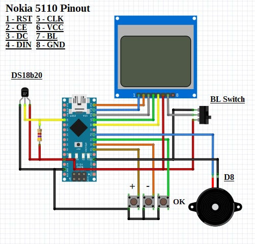

# Nokia 5110 Temperature Logger
An **Arduino** based project that uses **Nokia 5110 screen as display** and **DS18B20** temperature sensor.

## Materials Used :
- Any **ATmega328** based Arduino board such as Uno/Nano/Pro Mini
- Cheap Chinese Nokia 5110 display ( **Red or Blue and must be 5v tolerant** )
- **DS18b20** digital temperature sensor

## Libraries Used :
- LCD5110_Graph.h by **Henning Karlsen**
- Wire.h
- OneWire.h
---

