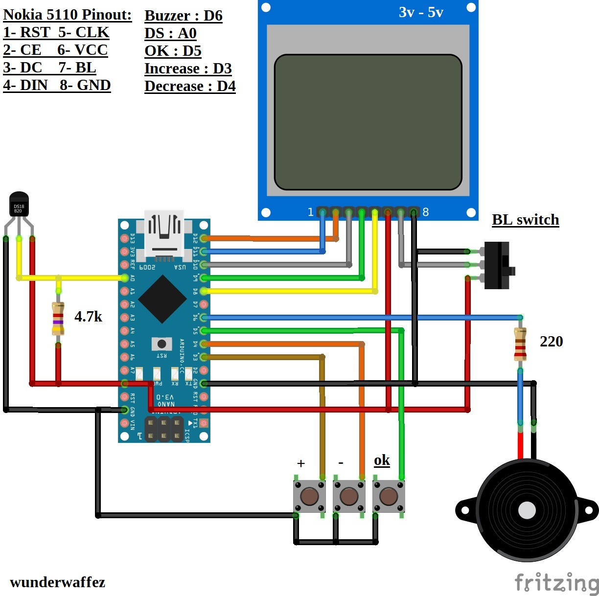

# Nokia 5110 Temperature Logger
An **Arduino** based project that uses **Nokia 5110 screen as display** and **DS18B20** temperature sensor.

## How It Works ?
At start you set log interval (min: 0, max: 140) as minutes and press "OK" button to start the process.
When it reaches %100, press "OK" button again to restart logging.

## Notes
This method doesn't use any SD card or EEPROM to save the logs so everytime you reset MCU you lose the data.
If you want to stop logging in the middle of the process press "reset" button on the Arduino.

## Materials Used :
- Any **ATmega328** based Arduino board such as Uno/Nano/Pro Mini
- Cheap Chinese Nokia 5110 display ( **Red or Blue and must be 5v tolerant** )
- **DS18b20** digital temperature sensor

## Libraries Used :
- LCD5110_Graph.h by **Henning Karlsen**
- Wire.h
- OneWire.h
---

